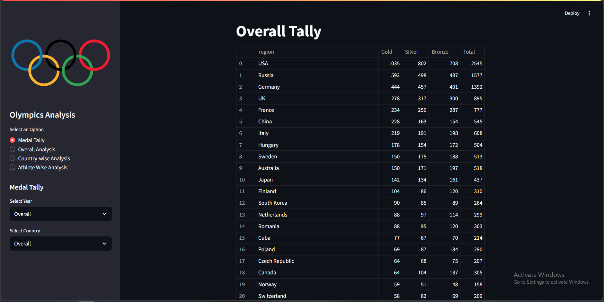
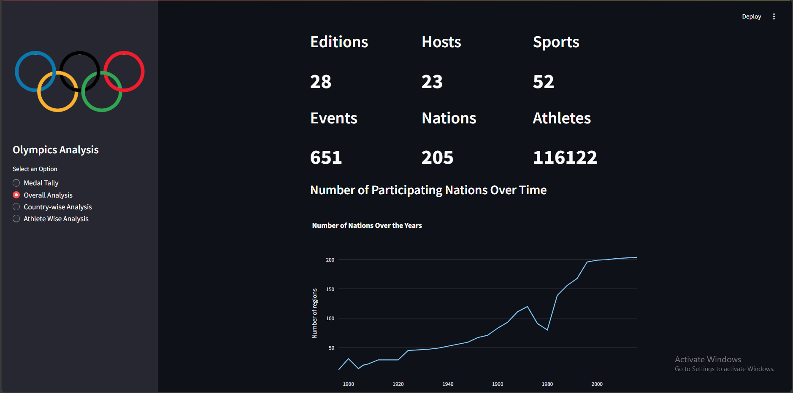
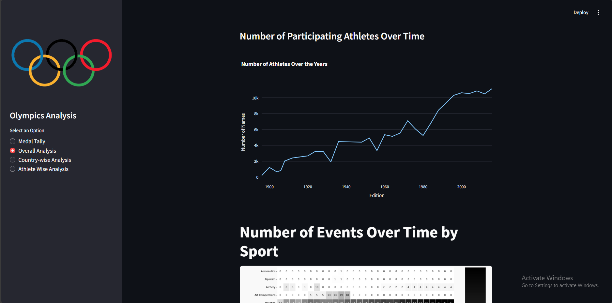
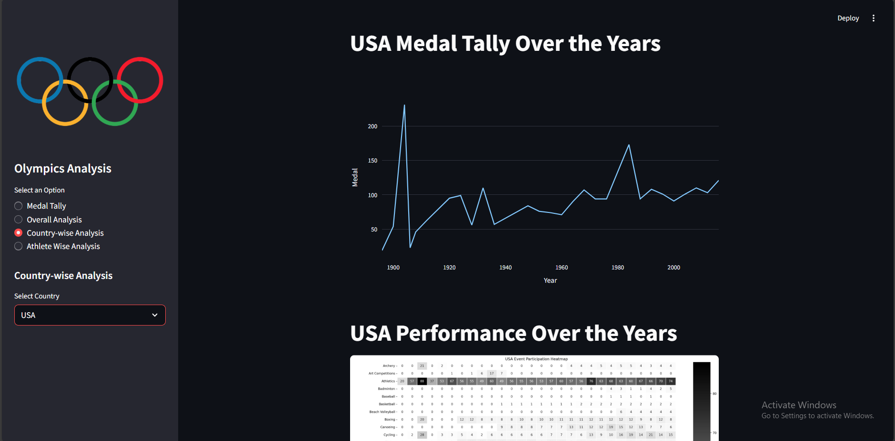
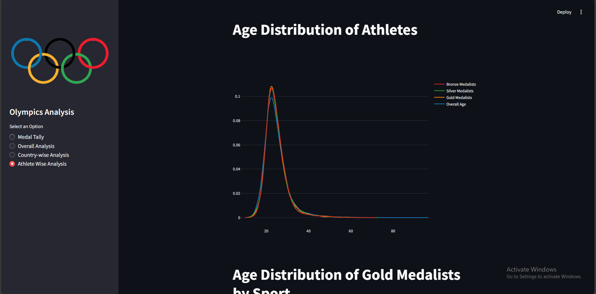
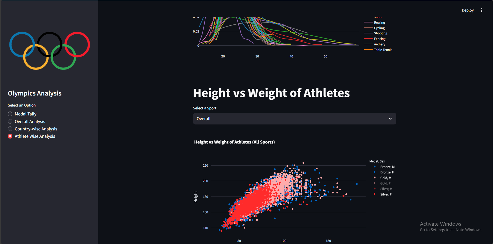
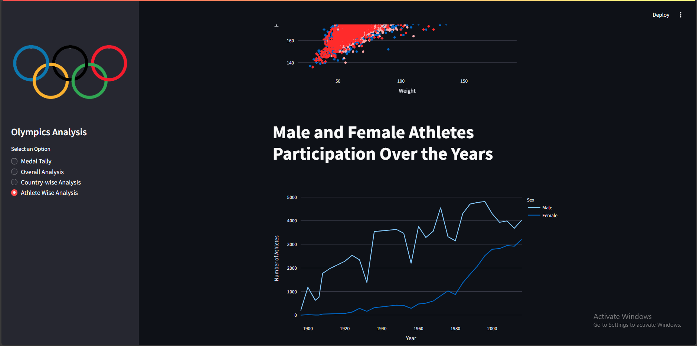

# 🏅 Olympics Data Analysis Dashboard

Welcome to the **Olympics Data Analysis** project — an interactive web application built using **Streamlit** that visualizes historical Olympic Games data. It lets users explore medal tallies, country-wise performance, athlete statistics, and more with engaging visuals powered by **Plotly**, **Matplotlib**, and **Seaborn**.

---

## 📂 Datasets Used

* **athlete\_events.csv** — Athlete-level data for all Olympic Games.
* **noc\_regions.csv** — Country codes and region mappings for National Olympic Committees (NOCs).

---

## 🚀 Features

* 🎯 **Medal Tally**: Filter medal counts by year and country.
* 🌍 **Overall Analysis**:

  * Number of editions, cities, sports, events, athletes, and nations
  * Trends over time (nations, events, athletes)
  * Event heatmap over years by sport
  * Most successful athletes by sport
* 📈 **Country-wise Analysis**:

  * Year-wise medal tally
  * Heatmap of event participation
  * Top 10 athletes from selected country
* 🧍‍♂️ **Athlete-wise Analysis**:

  * Age distribution of athletes and medalists
  * Age distribution of gold medalists by sport
  * Height vs Weight visualization
  * Male vs Female participation trends

---

## 🛠️ Technologies & Libraries

* **Python**
* **Streamlit**
* **Pandas**
* **Plotly**
* **Seaborn**
* **Matplotlib**
* **Scipy**
* **Custom Helper & Preprocessor Modules**

---

## 🧠 Learning Highlights

* Data cleaning and merging using Pandas
* Building interactive dashboards with Streamlit
* Visualizing complex data using Plotly & Seaborn
* Designing reusable data pipelines via helper modules
* Creating heatmaps, distribution plots, and line charts

---

## 📁 Project Structure

```
📁 Olympics-Analysis
├── app.py                      # Main Streamlit app
├── helper.py                   # Functions for data processing and visualization
├── preprocessor.py             # Data cleaning and merging logic
├── athlete_events.csv          # Olympic athletes dataset
├── noc_regions.csv             # Region mapping dataset
├── qq.png                      # Sidebar image/logo
└── README.md                   # Project documentation (you are here)
```

---

## ⚙️ Installation & Running the App

### 🔧 Install dependencies

```bash
pip install pandas matplotlib seaborn streamlit plotly scipy
```

### ▶️ Run the app

```bash
streamlit run app.py
```

Then open the local URL (e.g., `http://localhost:8501`) in your browser.

---

## 📸 Screenshots (Optional)

Include visuals from each section such as:

* Medal tally table

* Overall analysis graphs


* Country-wise medal tally

* Athlete-wise age distribution





---

## 🚧 Future Improvements

* Add **search feature** for athlete names.
* Include **downloadable reports (PDF/CSV)**.
* Integrate **live data updates**.
* Enhance UI with themes and animations.

---

## 🙌 Credits

* Data Source: [Kaggle - Olympic History Dataset](https://www.kaggle.com/datasets/heesoo37/120-years-of-olympic-history-athletes-and-results)
* Developed by: [Mian Arham Haroon](https://www.linkedin.com/in/mian-arham-haroon)
